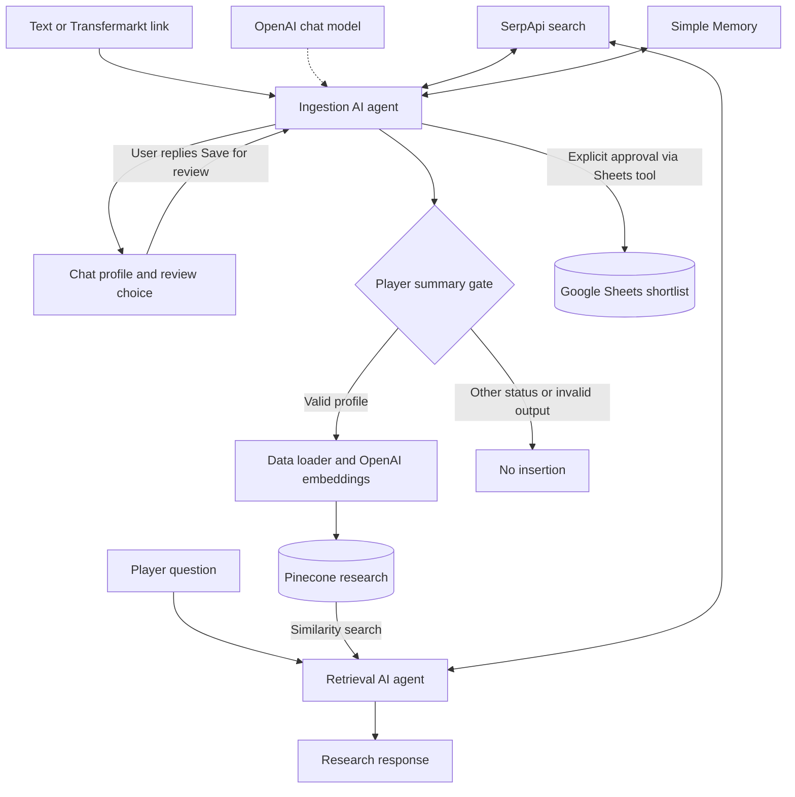

# Scout Signal

**Reusable football research to support human scouting decisions.**

A tested capstone prototype built with **n8n · OpenAI · SerpApi · Pinecone · Google Sheets**.

Scout Signal turns pasted text or a Transfermarkt player link into a short research profile, stores valid research automatically, and lets a decision maker optionally shortlist the player for review. A separate retrieval workflow uses stored research and fresh searches to check changes.

**Status:** demonstrated prototype. The supplied screenshots show successful n8n executions; they do not establish factual accuracy, scouting effectiveness or production readiness.

[Execution evidence](#demonstrated-execution) · [Setup](#setup) · [Limitations](#limitations) · [Workflow files](workflows/) · [LinkedIn post](docs/linkedin-post.md)

## The problem

Player research can become fragmented across links, notes and search results. Revisiting a player also means deciding which earlier facts are still current. Scout Signal explores a repeatable process for collecting a concise profile, retaining its research context and checking later changes.

It supports the researcher’s work. It does not score talent, predict performance, recommend transfers autonomously or replace watching matches and professional judgement.

## What it does

| Workflow | Input | Behaviour | Destination |
|---|---|---|---|
| Ingestion | Pasted text or a Transfermarkt profile link | Researches an identified player and produces a short profile | Chat and automatic Pinecone storage when the profile passes the gate |
| Optional review | An explicit “Save for review” response | Reuses previous research and appends or updates a row matched by Player ID | Your Google Sheets shortlist |
| Retrieval | A question about a player | Retrieves research; for current profiles or changes, can search for recent information | A chat response; updates are not automatically saved |

Choosing **No** declines the Sheets shortlist. It does **not** cancel the automatic storage of valid research in Pinecone.

## Architecture



**n8n** connects the steps. **OpenAI** generates the text and embeddings: numerical representations used to find related research. **SerpApi** supplies Google search results. **Pinecone** stores and retrieves that research by similarity. **Google Sheets** holds the separate review shortlist.

Combining retrieved information with a generated answer is commonly called retrieval augmented generation (RAG). Here, questions about a player’s current situation can also use live search. The graph describes the configured design; agent tool selection is not a deterministic guarantee.

### Ingestion details

The agent prompt requests a profile of 90 to 130 words in two paragraphs, a verified profile link and a Save for review/No choice. It asks the agent to confirm identity, label important unknowns and make at most two focused searches. These are prompt instructions, not hard enforcement.

The agent also returns internal JSON with `status`, `player_id`, `summary`, `sources` and `clarification`. The **Player summary?** node parses this output and requires `status: profile`, a summary containing text and at least one HTTP(S) source URL before insertion. It does not independently verify facts, URLs or player identity.

The loader stores original input, summary, source titles/URLs and research date as document text. Metadata contains `original_text` and `researched_at`. The export configures embeddings with 1,536 dimensions. The chat response happens before downstream indexing, so seeing a profile does not itself confirm that Pinecone insertion succeeded.

Simple Memory supports review choices in the same conversation. The Sheets tool is instructed to act only on explicit approval and to match rows by **Player ID**. Successful saves and a “No” response are designed to remain silent in chat; inspect execution results or the sheet to confirm a save.

### Retrieval details

Pinecone is connected as an agent tool with `topK: 8`. The prompt asks the agent to use the newest relevant research, ignore unrelated matches and duplicate chunks, and clarify ambiguous identities. Questions about current profiles or changes can use up to two focused searches; questions based only on stored research or historical information are instructed not to search.

Retrieval has no Sheets reader and no Pinecone insertion path. It cannot enumerate the review shortlist, guarantee a complete list of stored players, or automatically save refreshed research. Selecting the newest snapshot is an agent instruction, not a date filter applied by the database.

## Demonstrated execution

These are screenshots captured during prototype testing of the prototype, not a fresh reproduction of the workflows in this repository. Private execution/session identifiers are redacted; filenames are preserved.

### 1. Ingestion execution


The selected execution shows **Succeeded**, with the ingestion agent, gate and Pinecone path visible. This is evidence of an execution completing, not an independent audit of stored records or source accuracy.

### 2. Ingestion text


The example starts with a Nikos Karelis Transfermarkt profile link and shows a player summary in plain language, acknowledged information gaps and the Save for review/No choice. Football claims in this historical model output have not been independently verified here and should not be treated as current scouting facts.

### 3. Retrieval execution


The selected execution shows **Succeeded**, with Pinecone retrieval and SerpApi tool activity visible. The screenshot does not show the final retrieval answer, so it cannot establish the quality of a change comparison.

The supplied evidence does **not** demonstrate a completed Sheets save, every supported input/edge case, an accuracy benchmark, cost measurements or sustained reliability. Displayed execution durations are individual observations, not performance guarantees.

## Setup

### 1. Prepare your accounts

You need an n8n environment that supports the exported node types, OpenAI API access, a SerpApi key, a Pinecone index and a Google account with access to your review spreadsheet. Services may incur charges. The original n8n application version was not supplied; node versions are preserved in the exports, so compatibility must be checked on import.

The search node type is `n8n-nodes-serpapi.serpApiTool`. If n8n reports it missing, install/enable the corresponding SerpApi integration supported by your environment before running the workflows. Do not silently substitute a different node without checking its fields and output.

### 2. Import both JSON files

Download this repository, then import each file through the n8n workflow editor’s JSON import option:

* [`ScoutSignal_Ingestion_Output.json`](workflows/ScoutSignal_Ingestion_Output.json)
* [`ScoutSignal_Retrieval_Output.json`](workflows/ScoutSignal_Retrieval_Output.json)

Both are sanitized copies of the supplied exports and remain inactive. They are configuration templates, not a hosted app or a ready to run deployment.

### 3. Connect your credentials and model

Select your own credentials on every OpenAI, SerpApi, Pinecone and Google Sheets node. Credential references have been removed from these public copies.

Choose a chat model available to your OpenAI account in both **OpenAI Chat Model** nodes. The original model selection is preserved as export configuration, not a promise of availability. Explicitly select the same compatible embedding model in both **Embeddings OpenAI** nodes; the source exports set dimensions but do not explicitly name an embedding model.

### 4. Configure Pinecone

Replace `YOUR_PINECONE_INDEX` and `YOUR_PINECONE_NAMESPACE` in both workflows with your own values. Both workflows must use the same index, namespace and embedding model. Use an index whose vector dimension matches the configured **1,536 dimensions**. If you change embedding configuration, update both workflows and generate new embeddings for the research as needed.

The ingestion node uses **insert** mode; retrieval uses **retrieve-as-tool**. See the [official n8n Pinecone node documentation](https://docs.n8n.io/integrations/builtin/cluster-nodes/root-nodes/n8n-nodes-langchain.vectorstorepinecone/) for the node’s insertion and retrieval options.

### 5. Create the review sheet

Create a spreadsheet with these exact column headings:

```text
Saved Date | Player Name | Player Link | Summary | Sources | Original Input | Review Status | Player ID
```

These are eight separate cells in the header row, not a single cell containing the entire line. Select your spreadsheet and tab in the Sheets node, replacing `YOUR_GOOGLE_SHEET_ID` and `YOUR_SHEET_TAB_NAME`. Refresh the field mapping if needed. Keep **append or update** with **Player ID** as the matching column. New saves set Review Status to `To review`.

### 6. Run a small manual check

1. Open ingestion chat and submit a player profile link you can independently verify.
2. Inspect the profile and sources. Confirm the gate passes and the Pinecone node completes; inspect your index/namespace to verify stored research.
3. Reply **Save for review** in the same chat session. Verify the row and Player ID in your sheet. Repeat the approval to check row matching.
4. With another profile, reply **No**. Verify no shortlist row is added; valid research should still be in Pinecone.
5. Open retrieval chat and ask: “Using stored research only, what do we know about [full player name]?” Inspect tool activity for the intended use of stored research only.
6. Ask: “What has changed for [full player name] since the stored research?” Check the retrieved snapshot, live search results and final answer against dated sources.
7. Try an ambiguous first name, an invalid link and an unavailable search service. Check that failures and uncertainty are handled honestly.

These are suggested acceptance checks, not tests claimed to have passed. Do them before enabling a shared chat endpoint. Chat endpoint identifiers were removed; let your n8n instance generate its own and check chat response behaviour after import.

## Limitations

* **Source quality:** search snippets and knowledge graph fields can be incomplete or stale. These exports have no dedicated Transfermarkt node for fetching full pages; a link does not mean the full page was read.
* **Factual accuracy:** generated text can confuse identities or introduce unsupported facts. Check important claims against their sources before using them in a decision.
* **Controls defined in prompts:** search limits, approval checks, word counts and freshness rules largely depend on agent behaviour. The Sheets approval rule is not implemented as a separate deterministic approval gate.
* **Validation:** the storage gate checks basic structure and a URL pattern. There is no connected parser enforcing structured output or comprehensive schema validation.
* **Storage and freshness:** repeated ingestion can create duplicate research. There is no explicit deduplication using vector IDs, automated expiry, scheduled refresh or saving of retrieval updates.
* **Traceability:** source URLs are retained in research, but responses shown in chat intentionally omit detailed citations. A single profile link does not substantiate every claim.
* **Memory and errors:** review actions depend on the prior chat context. There is no dedicated workflow for handling errors and retries, rollback process or monitoring setup in these exports.
* **Privacy and access:** original input and research are sent to configured services and stored. Avoid confidential scouting notes without suitable access controls and arrangements for handling data. Respect source usage terms.
* **Evaluation and deployment:** no test dataset, measured accuracy, cost benchmark, security assessment or production operating procedure is provided.

## What this capstone demonstrates

The project brings together visual workflow orchestration, agent tool integration, basic output validation, vector storage and retrieval, and a separate human review decision. The exports make those design choices inspectable, alongside the limits of controls defined in prompts.

Potential next steps include a factual/identity evaluation set, deterministic approval checks, stronger schemas, citations for individual claims, explicit player metadata, duplicate handling and clearer failure reporting. These are future improvements, not implemented features.

## Repository contents

```text
workflows/                Sanitized n8n workflow JSONs
docs/screenshots/         Supplied execution screenshots, with identifiers redacted
docs/linkedin-post.md     Project announcement draft
docs/sanitization.md      Public export changes and verification scope
examples/                 Blank Google Sheets header template
README.md                 Architecture, setup, evidence and limitations
```

Built by [KKallias](https://github.com/KKallias) as a capstone project. Feedback on research quality, workflow design and evaluation is welcome through repository issues. Please exclude credentials and private execution data from reports.
